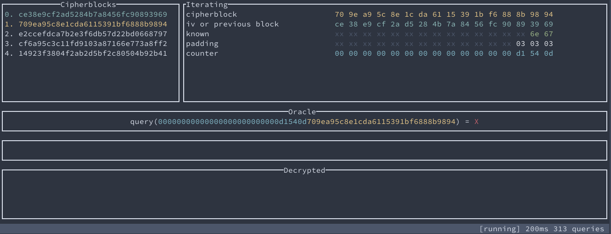

# CBC padding oracle demo

This demo shows the technical perspective of the CBC-padding oracle attack. To run it,
just hit:
```bash
$ cargo run
```

You will see a big panel. Adjust the terminal's size, so you can see everything properly.



## State machine

The whole demo is built around the state machine, that uses a CBC-padding oracle to decrypt a ciphertext.

On the left panel, you will see a ciphertext (together with an iv) that the machine is decrypting.

On the right panel, you will see all variables, that take part in decrypting the current block. You can also see the state of the machine in the title of this panel.

Below you will see an oracle and what kind of queries the machine makes to it.

The decrypted text will be gradually displayed on the `Decrypted` panel.

There is also a footer, which will tell you the state of simulation (`running` or `paused`), the timeout between machine loop iterations, and a number of queries to the oracle.

## Supported keys
- `c` - If you see that the machine is in the `paused` state, you can inspect variables and panels. After that, press `c` to continue.

- `right` and `left` arrows allow you to change the speed of iterations.

- `q` - quit.

- `r` - run the machine until the end, without pauses. Press `r` again to toggle it.

**Have fun!**
