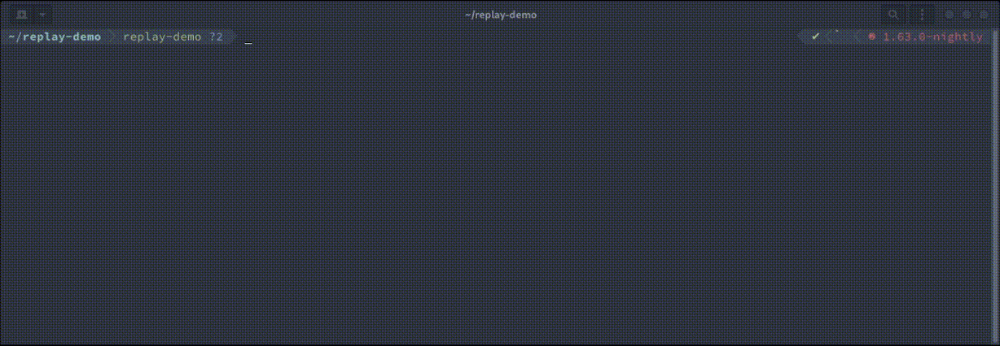

# Replay demo

This is a small demonstration of the attack (that is already spoiled in the name).

To run, just hit:
```bash
$ cargo run --release
```

After, you will see a screen with a map on the left. The `$` symbol is where your base is located. You were able to track the enemy signal going to and from the robot that is spying on nearby areas. The robot's symbol is `@`.

On the right, you can see all intercepted messages, that come from the enemy's base to control the robot. You know that the traffic is encrypted with `aes-gcm`, so there is no hope of forging packets to control the robot.

Or is it?

On the bottom there is a CLI panel, which you can use to send the packets to the robot. To enter the insert mode, press `[i]`, and to exit, press `[Esc]`.

You can send packets by entering the `send` command:
```
> send <hex string>
```

You can also scroll logs with `[PgDown]` and `[PgUp]`. To exit the scrolling mode press `[Home]`.

Your goal is to deliver the robot to your base so that it can be disassembled and used against the enemies.

Good luck!

P.S. There is a small chance the game will win by itself, so nevermind :)


## Spoiler

<details>

As you've probably guessed, the key is to reuse packets. Each packet is one of 4 possible commands: move `left`, `right`, `up` and `down`.

Demonstration of the process:


</details>
